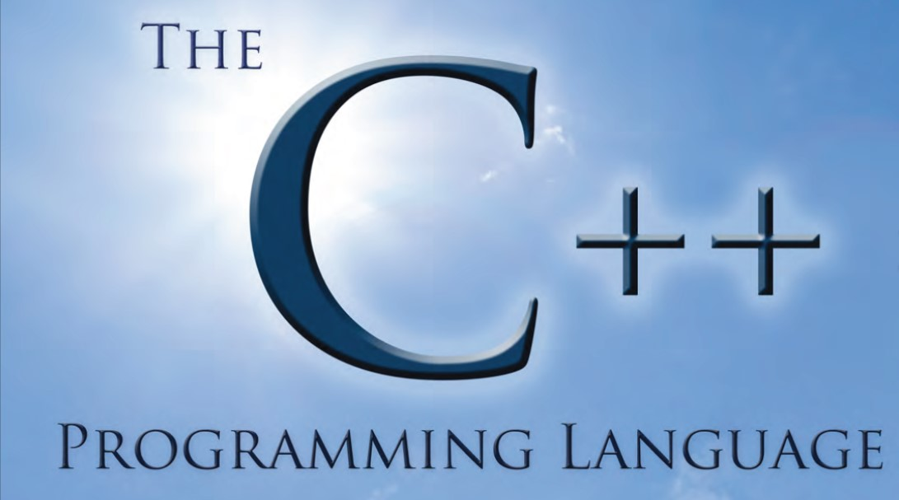

<!--  -->
<kbd></kbd>

    
# C++ PROGRAMMING 
- THIS IS A C++ REPOSITORY WHERE YOU CAN FIND VARIOUS TYPE OF PROGRAMS
- 

# LICENSE

## Authors

- [@Manmay Chakraborty](https://www.github.com/manmay2)

## 🚀 About Me
Hi, I am Manmay Chakraborty who is currently practising C++ on this repository.

## Feedback

If you have any feedback, please reach out to me at manmaychakarborty@gmail.com

## 🛠 Skills
Javascript, HTML, CSS,C,C++,PYTHON and JAVA

